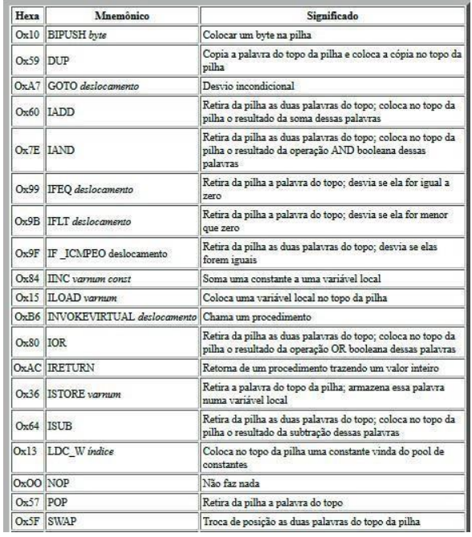
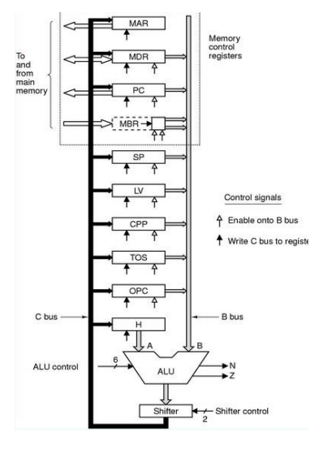
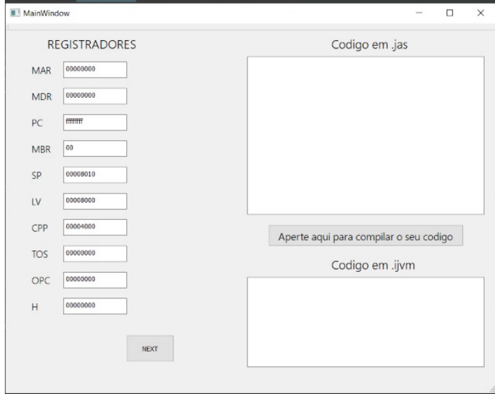
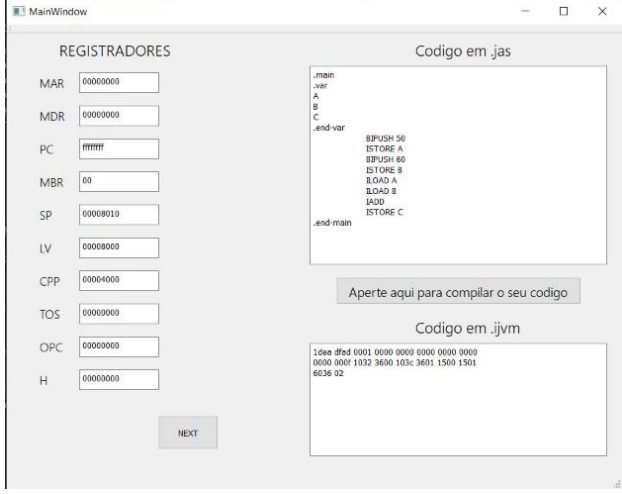

# Simulador e Montador IJVM

Este artigo tem como objetivo mostrar o desenvolvimento do montador e simulador IJVM, assim como o recebimento dos seus mnemônicos e o equivalente em binário baseado no comportamento da máquina virtual IJVM. Ademais, para cada instrução apresentada indica-se a sua operação em execução, bem como as alterações nos registradores, apresentando seus
valores em cada ciclo e a modificação nos dados da pilha de memória.

Microarquitetura é a forma como um determinado conjunto de instruções (ISA) é implementado em um processador, podendo ser implementado com microarquiteturas diferentes. As implementações podem variar devido a diferentes objetivos de um dado projeto ou a mudanças na tecnologia. A microarquitetura inclui os elementos constitutivos do processador e como estes interligam e interoperam para implementar o ISA. A ISA é aproximadamente o mesmo que o modelo de programação de um processador como visto por um programador de linguagem Assembly ou escritor de compilador. O ISA inclui o modelo de execução, registradores do processador, endereço e formatos de dados, entre outras coisas.

Máquina virtual Java – JVM, é um programa que carrega e executa os aplicativos Java, convertendo os bytecodes em código executável de máquina. A JVM é responsável pelo gerenciamento dos aplicativos, à medida que são executados. Graças à máquina virtual Java, os programas escritos em Java podem funcionar em qualquer plataforma de hardware e software que possua uma versão da JVM, tornando assim essas aplicações independentes da plataforma onde funcionam.

A IJVM desenvolvido por Andrew S. Tanenbaum é um exemplo de microarquitetura, que tem por função implementar o nível ISA. O nível ISA está posicionado logo acima da microarquitetura, e é ele que define como a microarquitetura deve ser construída. A IJVM faz parte da JVM e possui apenas instruções que lidam com inteiros. 

Sabe-se que IJVM é uma arquitetura de conjunto de instruções criada por Andrew Tanenbaum para sua arquitetura MIC-1. Por conseguinte, praticamente todas as linguagens de programação suportam o conceito de procedimentos, que tem variáveis locais, tais variáveis podem ser acessadas dentro dos procedimentos, mas deixam de ser acessíveis assim que o procedimento é devolvido. Dessa forma, é necessário um lugar da memória para manter essas variáveis. Assim, uma área na memória, denominada pilha, é reservada para o armazenamento de variáveis locais de um procedimento. Ademais, temse o conjunto de instrução da IJVM. Dessa forma, a tabela abaixo ilustra tais instruções, nas quais a primeira coluna dá a codificação hexadecimal da instrução, a segunda fornece o mnemônico em linguagem de montagem, enquanto a terceira fornece uma breve descrição do seu efeito.

 
  
O caminho de dados é a parte do processador que contém a ULA e todas as suas entradas e saídas. A figura 02 apresenta uma simplificação do modelo de arquitetura MIC1 e tem como principal característica uma das entradas da ULA (barramento A) sempre relacionado ao registrador “H”. Por outro lado, o barramento B pode receber dados de quaisquer outros  registradores.

 
 
O montador é responsável por receber as diversas instruções que foram escritas com os mnemônicos da IJVM e convertê-las em linguagem de máquina. Para que essa conversão
pudesse ocorrer de forma satisfatória, foi feito um código em Python que realizava manipulação de Strings, que possuía diversas funções e estruturas de repetição, de modo a verificar a sintaxe do código que foi escrito, se haviam erros na escrita de alguma instrução, verificar se havia a entrada de valores na pilha, o armazenamento em alguma variável ou a retirada desse valor da pilha e por fim, mostrar ao usuário, depois de escrever as instruções em IJVM, o equivalente de cada uma delas em suas respectivas equivalentes em hexadecimal. 

Também, foi criada uma interface gráfica com o auxílio do software QT Design. Nesse programa, só é possível a criação de interfaces gráficas em C++. Mas, com o auxílio
do dowload de uma Biblioteca chamada de PyQT, é possível a implementação de códigos utilizando a linguagem Python quando essa biblioteca é importada no código e com isso,
mesmo a interface gráfica sendo feita em C++, é possível manipular seus atributos, como os botões e as janelas, utilizando-se conceitos de Programação Orientada a Objetos voltados para a linguagem Python. Em outras palavras, essa biblioteca é especializada em converter um código escrito em C++ que foi desenvolvido no QT Design para um código em Python.

A interface criada no QT design para o montador e simulador IJVM é a mostrada na figura abaixo:

 
 
Nesse simulador IJVM, utilizou-se alguns exemplos de modo a verificar o funcionamento dessa interface, como mostra-se na figura a seguir:

 

